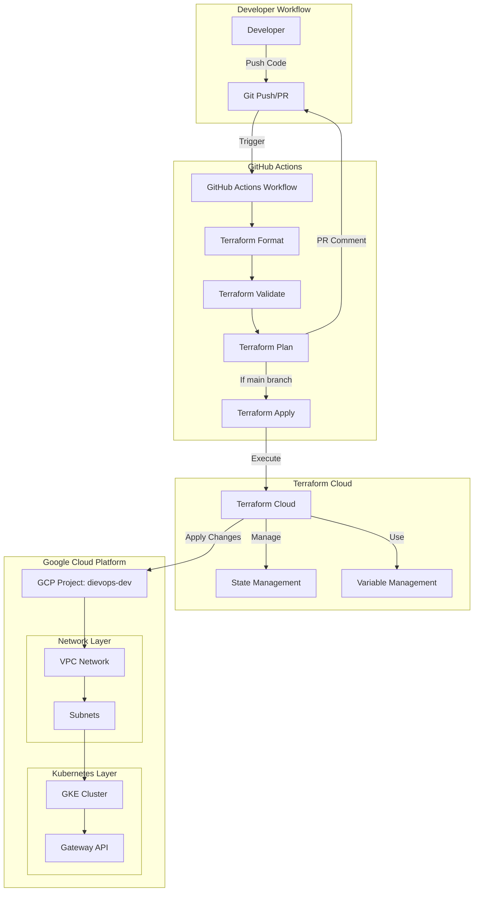
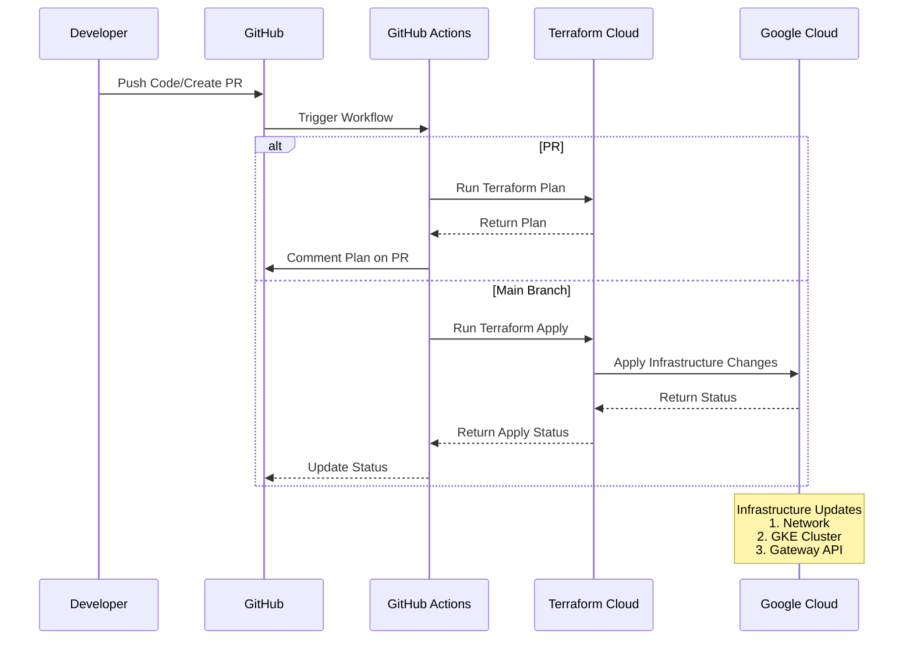

# DIEVOPS Architecture

## Infrastructure Overview

## Deployment Flow

## How to View These Diagrams

1. **GitHub Rendering**: 
   - GitHub natively renders Mermaid diagrams in markdown files
   - Simply view this file in the GitHub repository

2. **Local Viewing**:
   - Use VS Code with the Mermaid extension
   - Or visit [Mermaid Live Editor](https://mermaid.live) and paste the diagram code

3. **Documentation Updates**:
   - These diagrams are maintained in `docs/architecture.md`
   - Update them when making architectural changes
   - Include the diagram updates in your PRs 